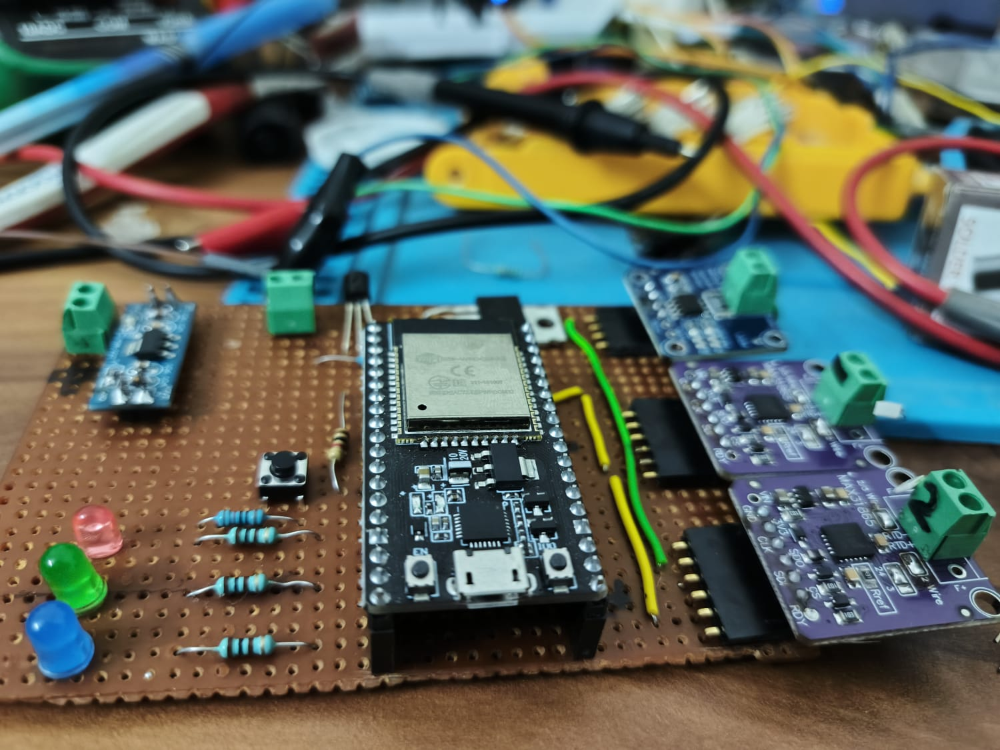
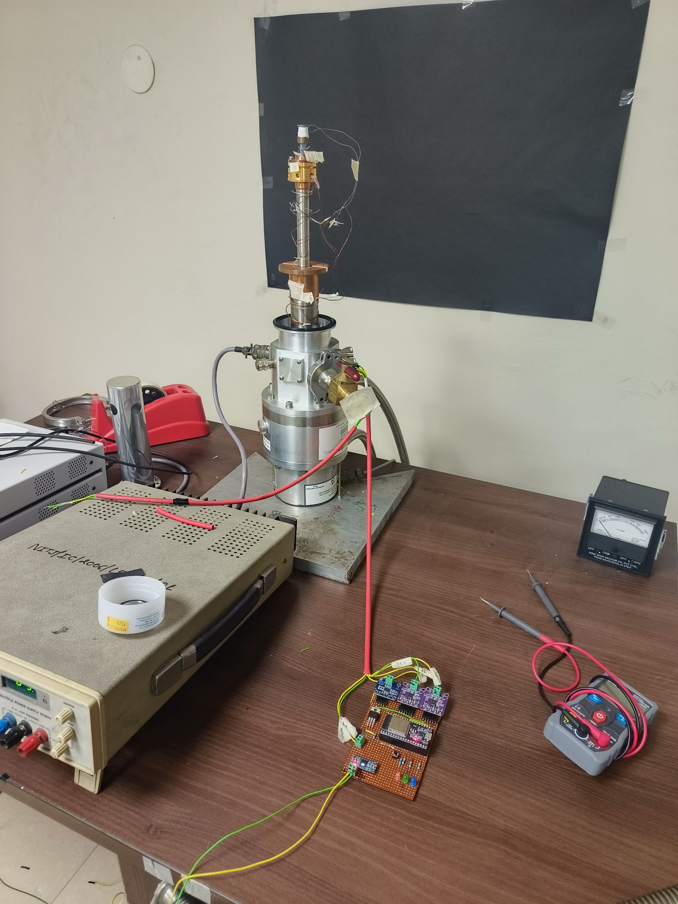
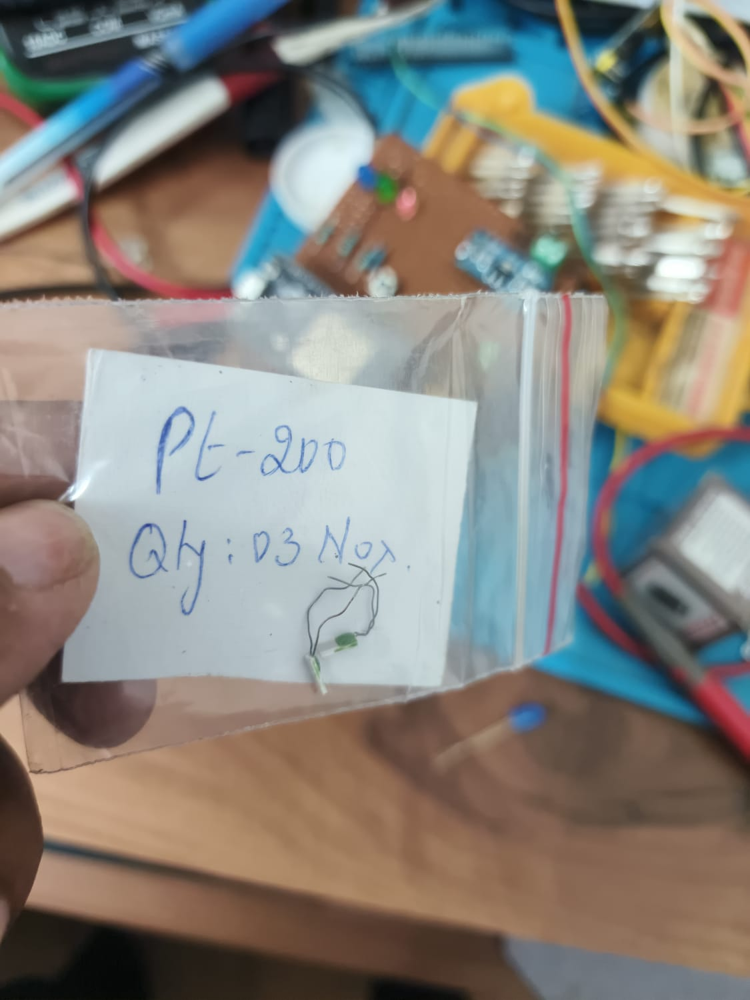

# ❄️ Thermal Conductivity Measurement at Cryogenic Temperature (73K to 123K)


A microcontroller-based system for calculating thermal conductivity of materials at cryogenic temperatures using precision RTD sensors (PT200), power measurement ICs, and cloud logging features.

---


---


---



---



---
## 📌 Project Overview

This project aims to **measure thermal conductivity** of sample materials in the **cryogenic range (73K to 123K)** by recording temperature gradients across the material and power supplied to a heater. The entire setup is built using **ESP32**, **MAX31865 (RTD amplifier)**, **INA219 (current & voltage sensing)**, and logs data to **Google Sheets** with real-time monitoring via an **embedded web dashboard**.

---

## 🛠️ Hardware Components

- 🔌 **ESP32 Development Board**
- 🌡️ **PT200 RTD Sensors** ×2 (Cold & Hot side)
- 📶 **MAX31865 Amplifiers** ×2
- ⚡ **INA219 Sensor** for voltage/current/power measurement
- 🔥 **Resistive Heater**
- 🧊 **Cryogenic Setup Chamber**
- 📈 **Google Sheets** for data logging
- 

---

## ⚙️ Features

- ✅ Dual PT200 RTD-based temperature measurement (Kelvin scale)
- ✅ Real-time power measurement with INA219
- ✅ Thermal conductivity calculation from temperature gradient and power input
- ✅ Auto-refreshing local web dashboard hosted by ESP32
- ✅ Google Sheets integration for real-time data logging

---

## 📊 Thermal Conductivity Formula

\[
k = \frac{Q \cdot L}{A \cdot \Delta T}
\]

Where:  
- \( k \) = Thermal conductivity (W/m·K)  
- \( Q \) = Power supplied to heater (W)  
- \( L \) = Length of the sample (m)  
- \( A \) = Cross-sectional area of the sample (m²)  
- \( \Delta T \) = Temperature difference across the sample (K)

---

## 🖼️ System Architecture

```
[ PT200 RTD Sensors ]   [ Heater Cotnrol ] 
        ↓                       ↑ 
[ MAX31865 Amplifier ]  →  [ ESP32 ] ← [ INA219 Power Sensor ]
                                ↓
                           Web Dashboard + Google Sheets
```

---

## 📦 Repository Structure

```bash
📁 Thermal-Conductivity-at
├── 📂 main
│   ├── main.ino
│   └── libraries/
├── 📂 setup
│   └── setup_diagram.png
├── 📄 README.md
└── 📄 LICENSE
```

---

## 🚀 Getting Started

1. Flash `main.ino` to ESP32 using Arduino IDE
2. Connect sensors and heater as per schematic
3. Open Serial Monitor or Web Dashboard
4. Observe readings and conductivity calculations in real-time

---
